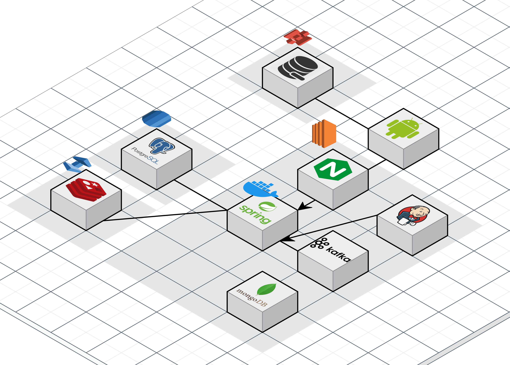

# SuperBoard  실시간 WorkFlow 관리 서비스
SSAFY 11기 삼성 SDI 연계 프로젝트 

## 📜 Contents
 1. [프로젝트 개요](#1️⃣프로젝트-개요)
 2. [주요 기능](#2️⃣주요-기능)
 3. [개발 환경](#3️⃣개발-환경)
 4. [기술 특이점](#4️⃣기술-특이점)
 5. [산출물](#5️⃣산출물)
 6. [팀원 소개](#6️⃣팀원-소개)

## 1️⃣프로젝트 개요
### 프로젝트 기간
2024.10.08 ~ 2024.11.19 (6주)

### 프로젝트 소개
SuperBoard는 팀 협업을 지원하는 실시간 WorkFlow 관리 서비스로, 보드, 리스트, 카드 등을 통해 작업을 시각적으로 관리할 수 있습니다. 사용자 간 실시간 변경 사항 공유와 알림 기능을 통해 효율적인 협업 환경을 제공합니다.

### 기획의도
SuperBoard는 직관적이고 접근성이 높은 프로젝트 관리 도구로, 드래그 앤 드롭 방식의 간단한 칸반 스타일 인터페이스를 통해 시각적으로 작업을 관리할 수 있습니다. 실시간 협업 및 동기화 기능을 제공하여 원격 환경에서도 팀워크를 원활히 지원합니다. 기술 수준에 관계없이 누구나 쉽게 사용할 수 있으며, 모바일 친화적으로 설계되어 언제 어디서나 프로젝트를 모니터링하고 관리할 수 있습니다.

## 2️⃣주요 기능 
- 워크스페이스, 보드, 리스트, 카드 생성 및 관리 기능
- 실시간 변경 사항 공유 (카드 수정, 댓글 추가, 첨부파일 등)
- 워크스페이스 및 보드 초대와 작업 변경에 대한 알림 기능
- 보드 배경 및 카드 커버 커스터마이징 (이미지 및 색상)
- 팀원의 역할에 따른 권한 기반 접근 제어와 협업 지원

## 3️⃣개발 환경

|   TYPE    | SKILL           | VERSION          |
| :-------: | :-------------- | :--------------- |
| LANGUAGES | Java            | 21               |
|           | Kotlin          | 2.0.21.          |
|    BE     | Spring Boot     | 3.3.5            |
|           | Spring Data JPA |                  |
|           | QueryDSL        | 5.0.0            |
|    FE     | Android (Kotlin) | ?               |
| DATABASE  | PostgreSQL(RDS) | 16.0             |
|           | MongoDB           | 4.0            |
|           | ElasticCache Redis| 7.1            |
|   INFRA   | AWS EC2         | ubuntu(x86)      |
|           | Jenkins         | 2.479            |
|           | Nginx           |                  |
|           | Docker          | 24.0.7           |
|           | Kafka           | bitnami/kafka:3.8|
|           | kafka-WebUi     | provectuslabs/kafka-ui|
|           | sonarqube       |                  |

## 4️⃣ 기술 특이점

---

### 1️⃣ 실시간 동기화

#### 문제
- 팀원이 작업을 실시간으로 확인해야 하는 환경에서 **Polling** 방식은 매번 서버에 요청해야 하며, 변경사항이 없어도 불필요한 요청이 발생하여 비효율적임.
- **SSE(Server-Sent Events)**는 서버에서 클라이언트로 변경사항 전달은 가능하지만 양방향 통신이 불가능.
- **WebSocket**은 데이터 유실, 순서 보장, 오프라인 상태 복구 등의 안정성 문제가 있음.

#### 해결법
1. **WebSocket**으로 지속 연결 유지
   - 클라이언트와 서버 간 변경사항을 실시간 동기화.
   - 추가 요청 없이 데이터를 빠르게 주고받아 성능 향상.
   
2. **Kafka**를 사용하여 변경 순서 보장
   - Kafka를 통해 동시 작업 시 순서를 보장.
   - 변경사항을 순서대로 저장 및 관리하며 소켓으로 전달.

3. **ACK(Acknowledgment)**으로 안정성 확보
   - 클라이언트-서버 간 수신 성공 여부 확인.
   - Kafka와 Redis 대기열로 데이터 유실 방지 및 재전송 시도.

4. **Redis 대기열로 요청 순서 관리**
   - 요청 순서 처리 및 ACK 누락 복구를 위한 약 3초의 유예 시간 설정.

---

#### 전체 통신 구조
1. **클라이언트 요청 전송**  
   - Http 통신으로 데이터를 서버로 전송.

2. **Kafka에 저장 및 순서 관리**  
   - 수신 데이터를 Kafka에 저장하여 변경 순서 보장.

3. **변경 사항 처리 및 전달**  
   - Kafka에서 데이터를 읽어 클라이언트로 전달 준비.

4. **WebSocket으로 실시간 전달**  
   - 변경 사항을 보드 내 모든 사용자에게 전달.

5. **ACK 확인 및 안정성 확보**  
   - 클라이언트에서 ACK 전송, Redis로 누락 요청 복구.

6. **오프라인 데이터 병합**  
   - 클라이언트가 다시 온라인 상태로 전환되면 로컬-서버 데이터 동기화.

---

### 2️⃣ 편리하고 직관적인 UI

#### 문제
- 사용자가 리스트나 카드를 드래그 앤 드롭할 때, 동시 작업 시 충돌이 자주 발생.
- 여러 사용자가 동시에 카드를 이동하면 순서 충돌 문제가 빈번.

#### 해결법
1. **거지수 방식**
   - 숫자를 충분히 큰 간격으로 부여(예: 100, 200, 300).
   - 중간 삽입 시 간격의 중간값(예: 150) 사용으로 효율적 관리.

2. **랜덤 오프셋 추가**
   - 중간값 계산 후 랜덤 값을 적용해 숫자 충돌 가능성 최소화.

---

### 3️⃣ 오프라인 모드

#### 문제
- 네트워크 연결 없는 상태에서 작업 내용을 저장해야 함.
- 서버 재연결 시 동기화 및 데이터 충돌 문제 발생.

#### 해결법
1. **클라이언트 DB(Room DB) 사용**
   - 로컬에 데이터를 저장하고 서버 연결 시 동기화.

2. **비트 마스킹으로 변경사항 추적**
   - 데이터 상태를 비트로 관리 (예: `0001` 추가, `0010` 수정, `0100` 삭제).

3. **상태 관리 변수 추가**
   - 데이터베이스에 상태 컬럼을 추가해 충돌 여부 확인.

4. **변경 사항 병합 알고리즘**
   - 최신 데이터를 기준으로 병합.
   - 충돌 시 사용자가 우선순위를 지정 가능.

## 5️⃣산출물 

### 아키텍처

## 6️⃣팀원 소개

|  이름  | 역할                                                                             |
| :----: | :------------------------------------------------------------------------------- |
| 조시현 | 팀장, Backend, Infra |
| 주효림 | Backend |
| 남경민 | Backend |
| 박준식 | Android |
| 최승준 | Android |
| 정다혜(~ 10.31) | Android |
| 여창민(10.30 ~) | Android |
